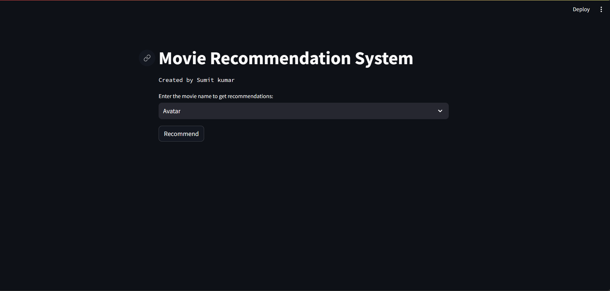
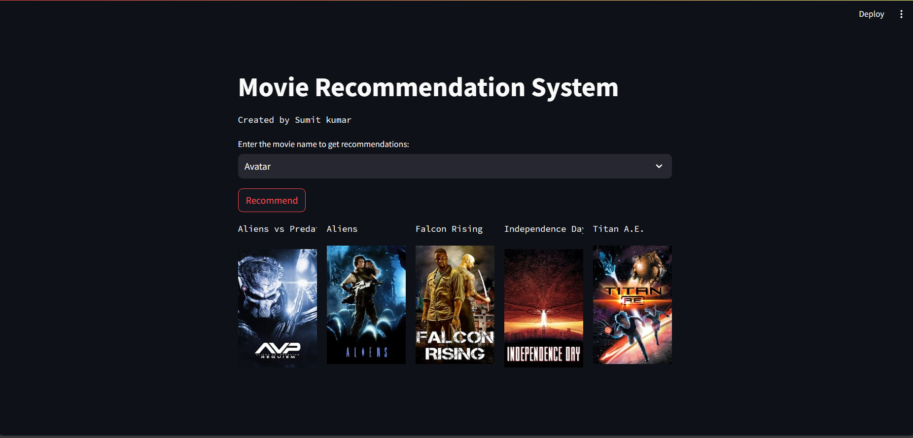

# Movie Recommendation System

This Movie Recommendation System is built using Python and deployed with Streamlit. It recommends similar movies based on the input movie provided by the user.

## How it Works

The recommendation system uses a content-based filtering approach. It analyzes the attributes of movies such as genres, keywords, cast, and crew to find similarities between movies. Once a movie is selected by the user, the system calculates the cosine similarity between the selected movie and all other movies in the dataset. The top 5 most similar movies are then recommended to the user.

## Technologies Used

- Python
- Pandas
- Scikit-learn
- Streamlit
- Requests

## Dataset

The dataset used in this project is the TMDB 5000 Movies Dataset, which consists of information about thousands of movies including their titles, overviews, genres, keywords, cast, and crew.

## Screenshots

*Description of screenshot 1*

*Description of screenshot 2*

## How to Use

1. Select a movie from the dropdown menu.
2. Click the "Recommend" button.
3. The system will display the top 5 recommended movies along with their posters.

## Development

To run the app locally:

1. Clone this repository.
2. Install the required dependencies using `pip install -r requirements.txt`.
3. Run the app using `streamlit run app.py`.

## Credits

This project was created by [Your Name]. It is based on a tutorial [link to tutorial] and utilizes the TMDB API for fetching movie posters.

## License

This project is licensed under the [MIT License](LICENSE).

